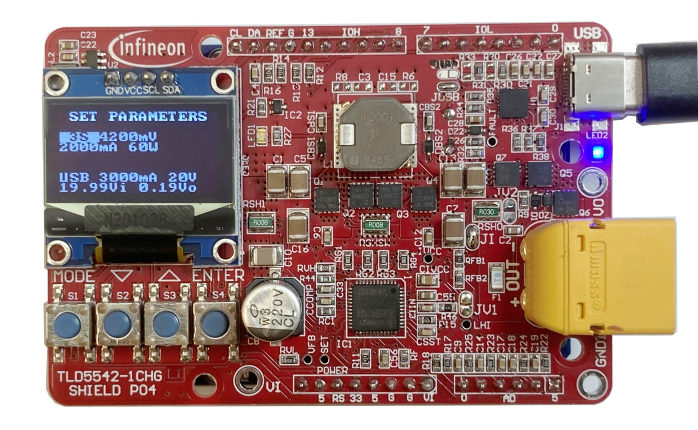

# USB-C PD LITIX™ Power Flex shield Arduino examples

This repository contains application examples for the Infineon's LITIX™ Power Flex [TLD5542-1CHG_SHIELD](https://www.infineon.com/cms/en/product/evaluation-boards/tld5542-1chg_shield/) compatible with Arduino UNO form factor microcontrollers evaluation boards. 

The following example applications are provided:

* Battery charger - [TLD5542-1CHARGER_V1.031](TLD5542-1CHARGER_V1.031)
* Adjustable voltage regulator - [TLD5542-1VREG_V1.02](TLD5542-1VREG_V1.02)
* LED driver - [TLD5542-1LED_DRV_V1.03](TLD5542-1LED_DRV_V1.03)

## :warning: Importance notice :warning:

Working with power applications involving high currents and batteries can be hazardous in many ways when handled incorrectly.
Before getting your hands on the hardware be sure that you know the necessary safety rules to deal with power electronic applications, and that you have carefully read the product [user guide](docs/Infineon-TLD5542-1ICHG_SHIELD-v01_00-EN.pdf).

## Hardware requirements

* TLD5542-1CHG_SHIELD
* Arduino UNO board
* USB-PD Adapter and/or external power supply
* Battery, LEDs and/or applicable load

## Software requirements

* Arduino IDE 1.8.13 (or higher)

All the supporting libraries required by the example sketches (other then the Arduino AVR core) are included within the example project folder. 

## Getting started

Download the [user guide](https://github.com/Infineon/arduino-examples-usb-c-litix-power-flex-shield/raw/develop/docs/Infineon-TLD5542-1ICHG_SHIELD-v01_00-EN.pdf) and follow the instructions to run the desired application example.

## Useful links

* [TLD5542-1CHG_SHIELD Product Page](https://www.infineon.com/cms/en/product/evaluation-boards/tld5542-1chg_shield/)
* [LITIX™ Power Flex Family Product Page](https://www.infineon.com/cms/en/product/power/lighting-ics/litix-automotive-led-driver-ic/litix-power-flex/)
* [TLD5542-1QV Datasheet](https://www.infineon.com/dgdl/Infineon-TLD5542-1QV-DataSheet-v01_10-EN.pdf?fileId=5546d4626fc1ce0b016ff1ac705d4601)
* [CYPD3177-24LQXQ Product Page](https://www.cypress.com/part/cypd3177-24lqxq)
* [CYPD3177-24LQXQ Datasheet](https://www.cypress.com/file/460416/download)
